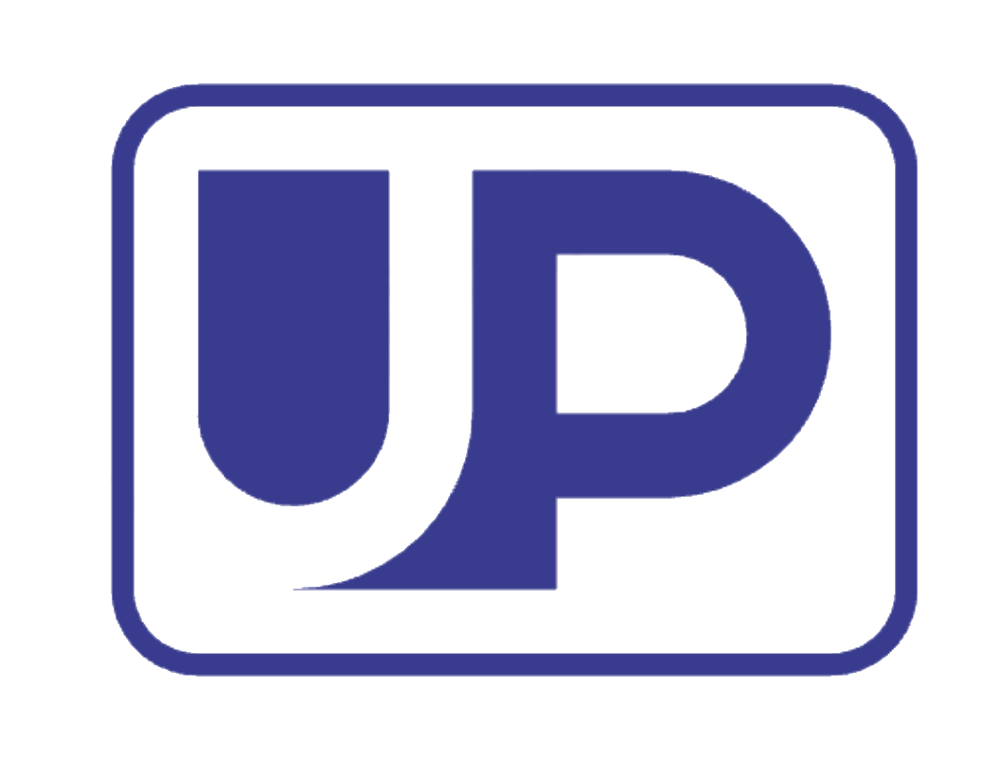

# UP

详细教程参见 [up 官方文档](http://spring.sensetime.com/docs/up/index.html)

## Benckmark

* [Det](benchmark/detection_benchmark.md)
* [Cls](benchmark/classification_benchmark.md)
* [Seg](benchmark/semantic_benchmark.md)
* [Multitask](benchmark/multitask_benchmark.md)

## 说明

分割部分主体代码来自light-seg, 分类代码来自prototype, 检测部分来自于POD
大部分文档也可参考 [POD 官方文档](http://spring.sensetime.com/docs/pod/index.html)

## TODO
- [ ] Transformer 基础backbone 支持
- [ ] MultiTask 支持
- [ ] Cls 相关自监督算法支持
- [ ] Det POD 未迁移部分
- [ ] 详细的功能文档

